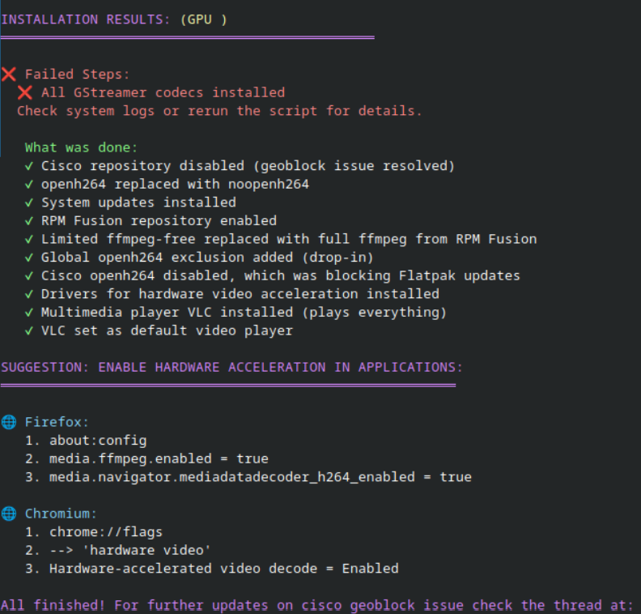
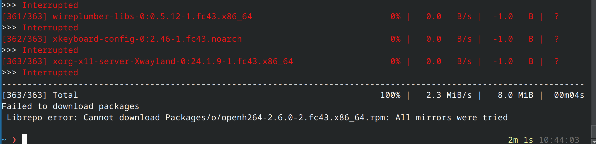
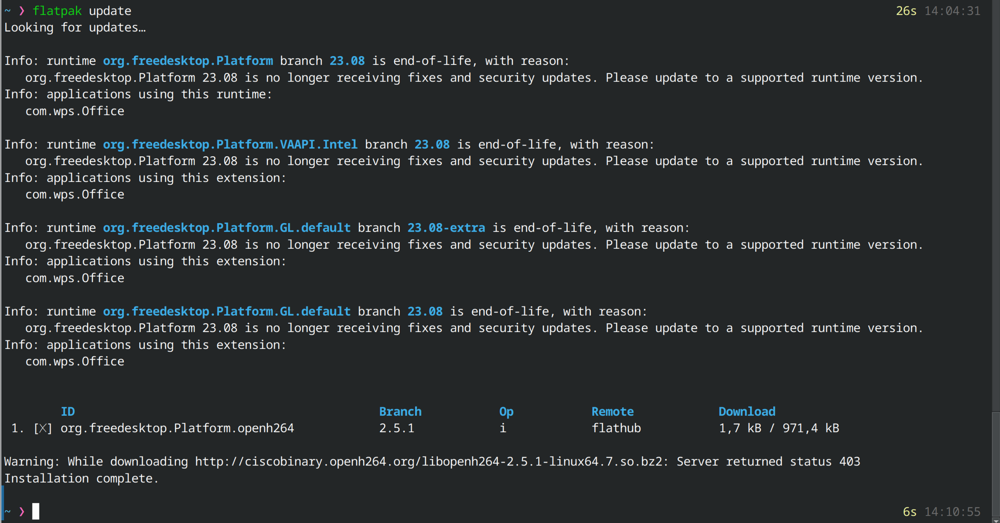
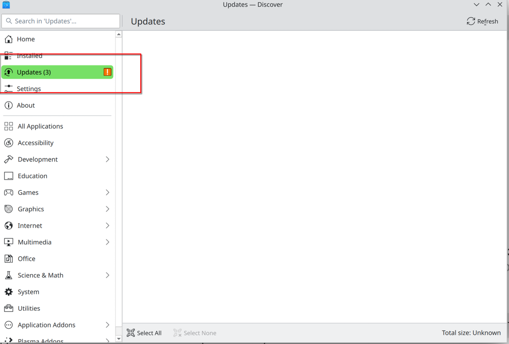

# Fedora Cisco 403 mitigation script: restoring updates after Cisco openH264 blocking + installing multimedia codecs for Fedora (dnf) / Fedora Atomic (ostree)

* Current version: 1.00 (November 7, 2025), by Andrei Manzhov
* Language: [Russian](README_RUS.md)/English depending on system locale
* Idempotent: Yes (can be rerun multiple times to complete failed steps)
* Automatic system configuration implemented, taking into account features of different Fedora versions, and error handling.
* Supported Fedora versions:
	⭐️ 40, 41, 42, 43, rawhide
	⭐️ Classic (dnf-based)
	⭐️ Fedora Immutable (Atomic, ostree-based): Kinoite (KDE Plasma), Silverblue (GNOME), Sericea (Sway), Onyx (Cinnamon)


## Installation and Usage
##### Quick download and run without saving:
Copy and execute in terminal:
```bash
curl -sSL https://raw.githubusercontent.com/supertico/fedora-open264-geoblock-fix/main/fedora-cisco-403-mitigation.sh | sudo bash
```

##### Download, save, and run manually:
```bash
curl -sSL https://raw.githubusercontent.com/supertico/fedora-open264-geoblock-fix/main/fedora-cisco-403-mitigation.sh -o fedora-cisco-403-mitigation.sh
chmod +x fedora-cisco-403-mitigation.sh
sudo ./fedora-cisco-403-mitigation.sh
```

## Provides full support for video codecs with hardware acceleration, eliminating dependence on Cisco
Why was this script written?

* Until now, Cisco provided the openh264 codec for free (to bypass patent issues with the H.264 codec). Fedora cannot include this codec in its repositories due to licensing restrictions, so it uses binary packages from Cisco.
* Recently, Cisco started blocking access to its servers for users from certain countries, leading to update failures.
* Using noopenh264 (an empty stub package) or switching to ffmpeg from RPM Fusion completely solves this problem without harming system functionality, but these actions have to be performed by each user manually.

## This script comprehensively solves video playback problems:
    🟢 Disables the Cisco openh264 repository
    🟢 Replaces openh264 with noopenh264 (prevents download attempts)
    🟢 Installs RPM Fusion with full ffmpeg
    🟢 Configures hardware video acceleration via VA-API
    🟢 Installs all necessary GStreamer plugins
    🟢 Installs VLC video player, which contains its own codecs and provides an alternative for playing files in virtually any video and audio formats.

## Result:
* System updates without errors
* All video files play
* Video services (YouTube, Netflix) work
* Hardware acceleration reduces CPU load by 30-50%



## Problem Description 1: Many videos do not play after a "clean" Fedora installation
⚠️ After installing Fedora "out of the box", users have access only to basic GPU drivers included in the Linux kernel (i915, amdgpu), so many video files (MP4, MKV) and video services (YouTube in Firefox, Netflix, etc.) do not work or show playback errors. Installing additional codecs (VA-API decoders, userspace components for video acceleration) is a common ritual after installing or reinstalling Fedora, but new users don't know about it and perceive video playback problems as shortcomings of the distribution developers.

#### Why? Due to patents and US legal restrictions, Fedora intentionally does not include popular video and audio codecs such as:

* H.264 (AVC) — the most widespread video codec in the world (used in 90%+ of videos)
* H.265 (HEVC) — modern codec for 4K video
* AAC — audio codec for MP4
* MP3 — the most popular audio codec

## Problem Description 2: What's wrong with Cisco OpenH264?
* In 2013, Cisco offered a solution to the H.264 problem: created **OpenH264** — an open implementation of the H.264 codec
* Cisco took upon itself the payment of all patent royalties for all OpenH264 users
* BUT with one condition: **users must download binary files only from Cisco servers**
* Fedora accepted this offer and added the fedora-cisco-openh264 repository, which automatically downloads the codec from Cisco servers.

⚠️ In 2024-2025, **Cisco started blocking access to its servers for some regions**. As a result, users in blocked regions experience:

    ❌ Cisco repository inaccessible (403 Forbidden error)
    
    ❌ DNF cannot download openh264
    
    ❌ Entire system update chain is blocked
    
    ❌ Flatpak applications cannot be installed/updated

Forums are flooded with complaints from users who have to learn how to solve this technically complex problem, as not only system updates are blocked, but also application installations.

## Problem symptoms:
- Status code 403 Forbidden
- Error: While downloading...
- Server returned status 403
- The HTTP server returned a status error 403: Forbidden
- No more mirrors to try
- Error: Unable to find a match.
- All mirrors were tried

##### Error 1: Status code 403 Forbidden (most common)
​This is the main geo-blocking error in blocked countries:

    DNF tries to download mozilla-openh264 from ciscobinary.openh264.org
    
    Server returns 403 Forbidden (access denied)
    
    DNF cannot continue updating and stops the entire operation.
    



##### Error 2: Cannot download metadata (repomd.xml)
​This happens when DNF cannot even connect to the Cisco repository:

Errors during downloading metadata for repository 'fedora-cisco-openh264'

Error: Failed to download metadata for repo 'fedora-cisco-openh264'

##### Error 3: Flatpak error, process finishes but updates are not installed due to openh264
​When you try to install a Flatpak application, it also requires openh264:



##### Error 4: System upgrade to the next version F41 → F42, F42 → F43 hangs
​When upgrading Fedora, OpenH264 also tries to upgrade, which can lead to hanging:

Error: Unable to download packages for fedora-upgrade

##### Error 5: Content-Length mismatch message
​Rare, but occurs. File size mismatch error.

##### Due to geo-blocking, Discover updates may also hang:
if you restore dnf/ostree and flatpak functionality, updates will start working in Discover again.



## How to check if the system has the necessary components for hardware video acceleration?
Use utilities:
* vainfo
* vdpauinfo

## Links to discussions on the topic:
* [Cisco openh264 geo-blocking](https://discussion.fedoraproject.org/t/ciscobinary-openh264-org-is-unreachable-in-some-countries-ru-ua-ir/161434)
* [Discussion on why H.264 is not included in Fedora by default](https://discussion.fedoraproject.org/t/h-264-support-in-fedora-workstation-by-default/114521)
* [Discussion on differences between H.264 and ffmpeg from RPM Fusion and blocks](https://www.reddit.com/r/Fedora/comments/1n8oqp5/ciscos_bringing_the_circus_to_town_their_openh264/)

(November 7, 2025)
