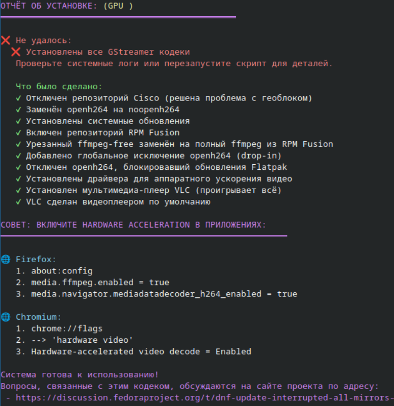

# Скрипт восстановления обновлений после блокировки Cisco openh264 и установки мультимедиа-кодеков для Fedora (dnf) / Fedora Atomic (ostree) 

* Текущая версия: 1.00 (7 ноября 2025), Автор Андрей Маньжов
* Русский/[Английский](README.md) язык в зависимости от system locale
* Идемпотентность: да (можно перезапускать многократно для завершения неудавшихся шагов)
* Реализована автоматическая настройка системы с учётом особенностей различных версий Fedora, и обработка ошибок. 
* Поддерживаются версии Fedora: 
	⭐️ 40, 41, 42, 43, rawhide 
	⭐️ классические (на базе dnf) 
	⭐️ Fedora Immutable (Atomic, на базе ostree): Kinoite (KDE Plasma), Silverblue (GNOME), Sericea (Sway), Onyx (Cinnamon)


## Установка и использование
##### быстрая загрузка и запуск без сохранения:
Скопируйте и выполните в терминале:
```bash
curl -sSL https://raw.githubusercontent.com/supertico/fedora-open264-geoblock-fix/main/fedora-cisco-403-mitigation.sh | sudo bash
```

##### загрузка, сохранение, и запуск вручную:
```bash
curl -sSL https://raw.githubusercontent.com/supertico/fedora-open264-geoblock-fix/main/fedora-cisco-403-mitigation.sh -o fedora-cisco-403-mitigation.sh
chmod +x fedora-cisco-403-mitigation.sh
sudo ./fedora-cisco-403-mitigation.sh
```

## Обеспечивает полноценную поддержку видеокодеков с аппаратным ускорением, устраняя зависимость от Cisco
По какой причине пришлось написать этот скрипт?

* До сего момента Cisco предоставляла кодек openh264 бесплатно (для обхода патентных проблем с кодеком H.264). Fedora не может включить этот кодек в свои репозитории из-за лицензионных ограничений, поэтому использует бинарные пакеты от Cisco. 
* Недавно Cisco начала блокировать доступ к своим серверам для пользователей из определённых стран, что привело к сбоям обновлений.
* Использование noopenh264 (пустой пакет-заглушка) или переход на ffmpeg из RPM Fusion полностью решает эту проблему без ущерба для функциональности системы, но эти действия приходится выполнять каждому пользователю самостоятельно.

## Данный скрипт решает проблемы с воспроизведением видео комплексно:
    🟢 отключает репозиторий Cisco openh264
    🟢 заменяет openh264 на noopenh264 (предотвращает попытки загрузки)
    🟢 устанавливает RPM Fusion с полным ffmpeg
    🟢 настраивает аппаратное ускорение видео через VA-API
    🟢 устанавливает все необходимые GStreamer плагины
    🟢 устанавливает видеоплеер VLC, который содержит свои собственные кодеки и обеспечивает альтернативную возможность воспроизведения файлов практически любых видео и аудиоформатов.
    
## Результат:
* Система обновляется без ошибок
* Все видеофайлы воспроизводятся
* Видеосервисы (YouTube, Netflix) работают
* Аппаратное ускорение снижает нагрузку на CPU на 30-50%



## Описание проблемы 1: Многие видео не воспроизводятся после "чистой" установки Fedora
⚠️ После установки Fedora "из коробки" пользователю доступны только базовые GPU драйверы, которые входят в ядро Linux (i915, amdgpu), поэтому многие видеофайлы (MP4, MKV) и видеосервисы (YouTube в Firefox, Netflix и т.д.) не работают или показывают ошибки воспроизведения. Установка дополнительных кодеков (декодеры VA-API, userspace компоненты для видео ускорения) является обычным ритуалом после установки или переустановки Fedora, но новые пользователи об этом не знают и воспринимают проблемы с воспроизведением видео как недоработки разработчиков дистрибутива.

#### Почему? Из-за патентов и юридических ограничений США Fedora намеренно не включает популярные видео и аудио кодеки, такие как:

* H.264 (AVC) — самый распространённый видеокодек в мире (используется в 90%+ видео)
* H.265 (HEVC) — современный кодек для 4K видео
* AAC — аудиокодек для MP4
* MP3 — самый популярный аудиокодек

## Описание проблемы 2: Что не так с Cisco OpenH264?
* В 2013 году Cisco предложила решение проблемы с H.264: создала **OpenH264** — открытую реализацию кодека H.264
* Cisco взяла на себя оплату всех патентных роялти за всех пользователей OpenH264
* НО с одним условием: **пользователи должны загружать бинарные файлы только с серверов Cisco**
* Fedora приняла это предложение и добавила репозиторий fedora-cisco-openh264, который автоматически загружает кодек с серверов Cisco.

⚠️ В 2024-2025 годах **Cisco начала блокировать доступ к своим серверам для некоторых регионов**. В результате, у пользователей в заблокированных регионах:
    ❌ Репозиторий Cisco недоступен (ошибка 403 Forbidden)
    ❌ DNF не может загрузить openh264
    ❌ Вся цепочка обновлений системы блокируется
    ❌ Flatpak приложения не устанавливаются/обновляются

Форумы переполнены жалобами пользователей, которым приходится изучать, как решать эту технически сложную проблему, поскольку блокируется не только обновление системы, но и установка приложений. 

## Симптомы проблемы: 
- Status code 403 Forbidden 
- Error: While downloading... 
- Server returned status 403
- The HTTP server returned a status error 403: Forbidden
- No more mirrors to try
- Error: Unable to find a match.
- All mirrors were tried

##### Ошибка 1: Status code 403 Forbidden (самая распространённая)
​Это основная ошибка геоблокировки в заблокированных странах:
    DNF пытается загрузить mozilla-openh264 с ciscobinary.openh264.org
    Сервер возвращает 403 Forbidden (доступ запрещён)
    DNF не может продолжить обновление и останавливает всю операцию.


##### Ошибка 2: Cannot download metadata (repomd.xml)
​Это происходит, когда DNF не может даже подключиться к репозиторию Cisco:
Errors during downloading metadata for repository 'fedora-cisco-openh264'
Error: Failed to download metadata for repo 'fedora-cisco-openh264'

##### Ошибка 3: Ошибка Flatpak, из-за openh264 процесс завершается но обновления не устанавливаются
​Когда вы пытаетесь установить Flatpak приложение, оно также требует openh264:


##### Ошибка 4: Обновление системы до следующей версии F41 → F42, F42 → F43 зависает
​При обновлении версии Fedora обновляется и OpenH264, что может привести к зависанию:
Error: Unable to download packages for fedora-upgrade

##### Ошибка 5: Сообщение Content-Length mismatch
​Редкая, но встречается. Ошибка несоответствия размера файла.

##### Из-за геоблока могут также зависать и обновления в Discover:
если восстановить работу dnf/ostree и flatpak, то обновления снова начнут работать и в Discover.


## Как проверить, есть ли в системе необходимые компоненты для аппаратного ускорения видео?
используйте утилиты:
* vainfo
* vdpauinfo

## Ссылки на обсуждения по теме:
* [Cisco openh264 геоблокировка](https://discussion.fedoraproject.org/t/ciscobinary-openh264-org-is-unreachable-in-some-countries-ru-ua-ir/161434)
* [Обсуждение, почему H.264 не включён в Fedora по умолчанию](https://discussion.fedoraproject.org/t/h-264-support-in-fedora-workstation-by-default/114521)
* [Обсуждение различий между H.264 и ffmpeg из RPM Fusion и блокировок](https://www.reddit.com/r/Fedora/comments/1n8oqp5/ciscos_bringing_the_circus_to_town_their_openh264/)

(7 ноября 2025 г.)
